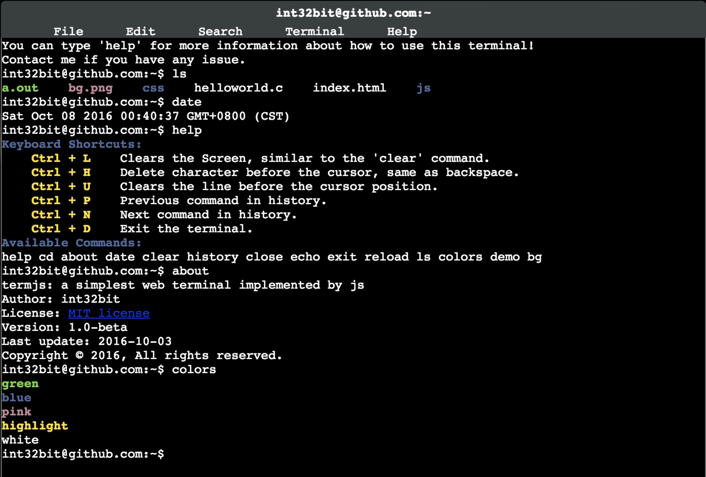

👉[中文版本](README.zh.md)

## About termjs

The termjs is a web terminal implemention in javascript based on jquery & easyui frame. It's very easy to add new commands for its auto-discovery mechanism.



## What's been done so far

* Keyboard shortcuts, like `Ctrl-L` to clear the screen.
* Display the history list with line numbers.
* Auto-complete.
* ...

## Quick start

A good start using docker:

```sh
docker build -t yourname/termjs
docker run -t -i --rm -p 8000:8000 -v `pwd`:/root  --name termjs yourname/termjs
```
Open `http://localhost:8000` with chrome(Other brower may not compatible）.

For the impatient:

```
./start_term.sh
```

## Add new command

Edit `js/commands.js` and add a command function with the prefix of `do_`. For example, assume you want to implement `hello` command, you may append following code in `commands.js`:

```js
function do_hello(args)
{
	return "HelloWorld!";
}
```

No any other work you need care. You can now run `hello` command in your web terminal, it will output:

```
HelloWorld!
```

## LICENSE

MIT License
