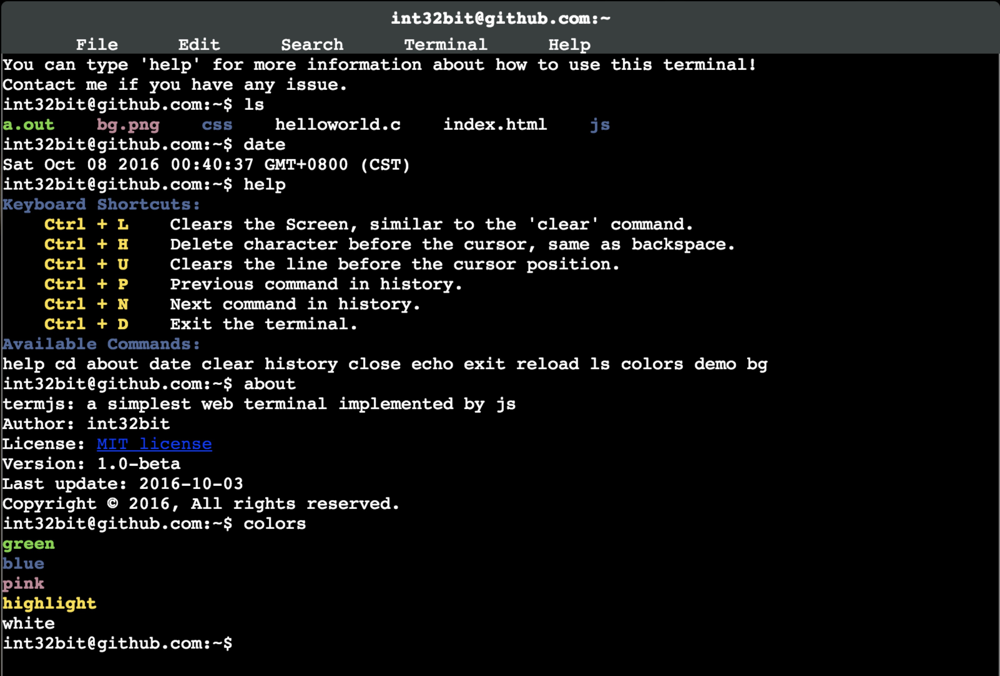

👉[English](README.md)

## 关于termjs

termjs是一个基于javascript实现的web模拟终端，使用了jquery和easyui库。由于使用了命令自动发现机制，因此扩展新命令将变得非常容易。



## 目前实现的特性

* 支持部分shell快捷键，比如`Ctrl-L`清屏,`Ctrl-U`删除该行内容等。
* 支持记录历史命令功能，使用方向键或者`Ctrl-P`、`Ctrl-N`遍历执行过的所有命令。
* 支持命令自动补全功能, 使用`Tab`键触发。
* ...

## 快速开始

使用Docker是一个好的开始:

```sh
docker build -t yourname/termjs
docker run -t -i --rm -p 8000:8000 -v `pwd`:/root  --name termjs yourname/termjs
```

使用google chrome浏览器打开`http://localhost:8000`即可，注意使用其它浏览器可能出现不兼容情况。

如果你没有耐心一步步执行，我写了个一键运行脚本:

```
./start_term.sh
```

## 增加新命令

编辑`js/commands.js`文件，增加你的函数实现并且函数名以`do_`开头即可。 比如, 假设你要实现`hello`命令，你只需要在`commands.js`文件增加以下内容:

```js
function do_hello(args)
{
	return "HelloWorld!";
}
```

不需要其它额外工作，在Web终端下就可以执行`hello`命令了，执行后输出:

```
HelloWorld!
```

## 协议

MIT License